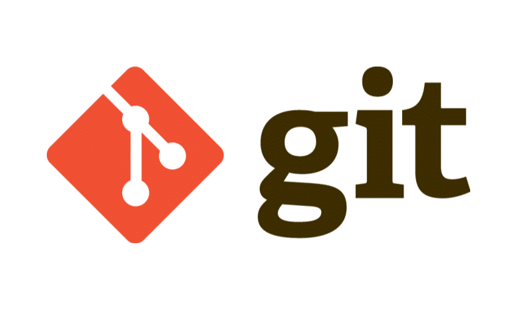

<h1>
  
</h1>

# Indice

- [Sobre](#-sobre)
- [Tecnologias Utilizadas](#-tecnologias-utilizadas)
- [Como acessar o projeto](#-como-acessar-o-projeto)

## 📖Sobre

Esse projeto foi criado em função do curso da **Alura** sobre introdução, ferramentas e estratégias no **Git** e **GitHub**.

---

## 💻Tecnologias utilizadas

Esse projeto foi desenvolvido com as seguintes tecnologias:

- [Alura](https://www.alura.com.br/)
- [Pipefy](https://www.pipefy.com/pt-br/)
- [VScode](https://code.visualstudio.com/)
- [Git](https://git-scm.com/)
- [GitHub](https://github.com/)

---

## 📂Como acessar o projeto

- Acesse o repositório pelo próprio **GitHub** https://github.com/Mira757/Aula-Alura-Byron

- Clone o repositório no **Git**

```bash

# Clonar o repositório
git clone https://github.com/Mira757/Aula-Alura-Byron

# Acessar o histórico do repositório
git log

# Acessar o histórico do repositório de maneira simplificada

git log --oneline
```

---

Desenvolvido por João Vitor Mira
